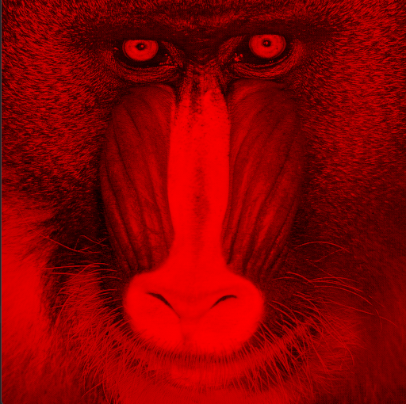
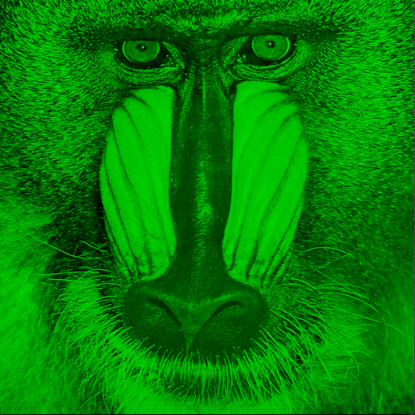
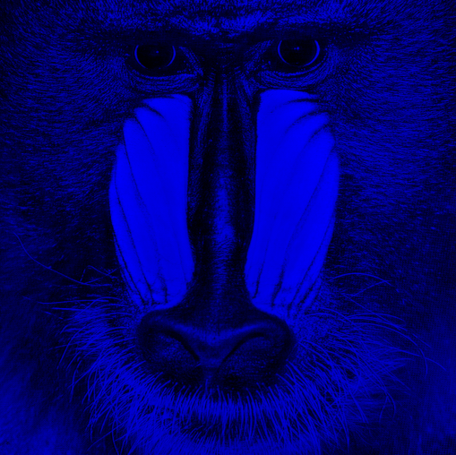
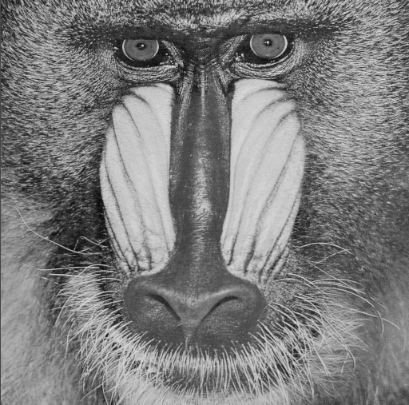
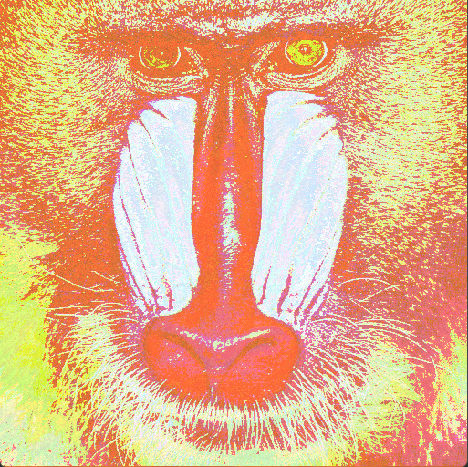
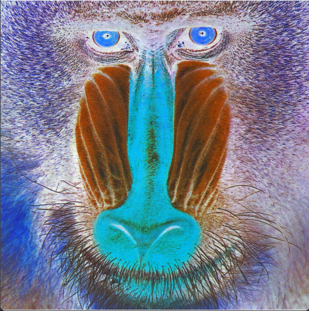
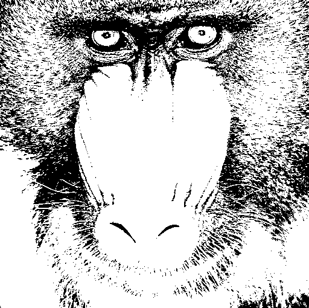
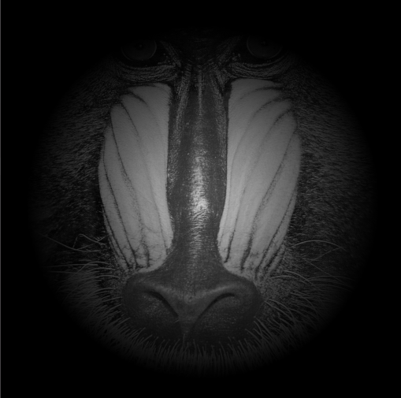
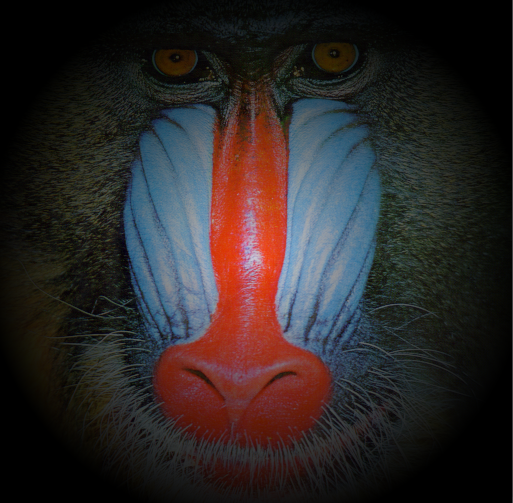
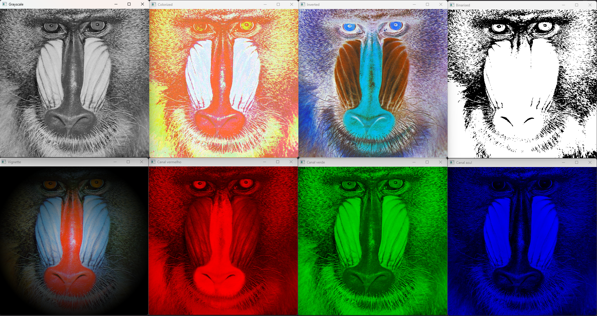

# Processamento grafico - Lista 5

## Enunciado:

1. #### Modifique o fragment shader para criar os seguintes "filtros". 

* _Renderizar apenas o canal vermelho, verde ou azul separadamente_
* _Grayscale com média ponderada_
* _Colorização, mandando como uma uniform a cor a acrescentar_
* _Inversão_
* _Binarização_
* _Crie um filtro seu!_
* _(DESAFIO) Efeito de "vignete"_

2. #### O desafio é: mostre quatro ou mais dos filtros implementados na mesma cena (mostre lado a lado os diferentes filtros).

## Imagem base:


## Resolução:
### Questão 1:

### a) Renderizar apenas o canal vermelho, verde ou azul separadamente:

__Red:__



```py
def renderizar_canal_vermelho(self, img):
    img_r = img.copy()
    for line in range(img.shape[0]): 
        for column in range(img.shape[1]): 
            img_r.itemset((line,column,0),0) 
            img_r.itemset((line,column,1),0) 
    return img_r
```

__Green:__



```python
def renderizar_canal_verde(self, img):
    img_g = img.copy()
    for line in range(img.shape[0]):  
        for column in range(img.shape[1]):  
            img_g.itemset((line, column, 0), 0)  
            img_g.itemset((line, column, 2), 0)  
    return img_g
```
__Blue:__



```python
def renderizar_canal_azul(self, img):
    img_b = img.copy()
    for line in range(img.shape[0]):  
         for column in range(img.shape[1]):  
             img_b.itemset((line, column, 1), 0)  
             img_b.itemset((line, column, 2), 0)  
    return img_b
```

### b) Grayscale com média ponderada:



```python
def grayscale_media_ponderada(self, img):
    img_grayscale = img.copy()
    for line in range(img.shape[0]):  
        for column in range(img.shape[1]):  
            media_pond = img.item(line, column, 0) * 0.299 + img.item(line, column, 1) * 0.587 + img.item(line, column, 2) * 0.114
            img_grayscale.itemset((line, column, 0), media_pond)
            img_grayscale.itemset((line, column, 1), media_pond)
            img_grayscale.itemset((line, column, 2), media_pond)
    return img_grayscale
```

### c) Colorização, mandando como uma uniform a cor a acrescentar:



```python
def colorizar(self, img, corUniforme):
    img_colorized = img.copy()
    for line in range(img.shape[0]):  
        for column in range(img.shape[1]):  
            B = img.item(line, column, 0) | corUniforme[0]
            G = img.item(line, column, 1) | corUniforme[1]
            R = img.item(line, column, 2) | corUniforme[2]
            img_colorized.itemset((line, column, 0), B) 
            img_colorized.itemset((line, column, 1), G)  
            img_colorized.itemset((line, column, 2), R)  
    return img_colorized
```

### d) Inversão: 



```python
def inverter(self, img):
    img_inverted = img.copy()
    for line in range(img.shape[0]):
        for column in range(img.shape[1]):
            img_inverted.itemset((line, column, 0), 255 - img.item(line, column, 0))
            img_inverted.itemset((line, column, 1), 255 - img.item(line, column, 1))
            img_inverted.itemset((line, column, 2), 255 - img.item(line, column, 2))
    return img_inverted
```
### e) Binarização:



```python
import cv2 as cv

def binarizar(self, img, limiar):
    img_gray = cv.cvtColor(img, cv.COLOR_BGR2GRAY)
    img_binarised = img_gray.copy()
    for line in range(img_gray.shape[0]):
        for column in range(img_gray.shape[1]):
            if img_gray.item(line, column) < limiar:
                img_binarised.itemset((line, column), 0)
            else:
                img_binarised.itemset((line, column), 255)
    return img_binarised
```

### f) Personal Mixed:



```python
def mixed_filter(self, img, raio):
    img_gray = self.grayscale_media_ponderada(img) 
    img_vignette = self.vignette(img_gray, raio) 
    return img_vignette 
```

### g) Vignette:



```python
def vignette(self, img, raio):
    img_vignette = img.copy()
    h, w = img.shape[:2]  # altura e largura da imagem
    cx, cy = w // 2, h // 2  # centro da imagem
    for line in range(h):
        for column in range(w):
            d = ((line - cy) ** 2 + (column - cx) ** 2) ** 0.5  # distância do pixel ao centro
            f = max(0, 1 - d / raio)  # fator de escurecimento
            img_vignette[line, column] = img_vignette[line, column] * f  # multiplica o pixel pelo fator
    return img_vignette
```

### Questão 2 - Mostre quatro ou mais dos filtros implementados na mesma cena:




```python
import cv2 as cv

img = cv.imread('baboon.png')  # original
corModificadora = [255, 0, 0]
k = 150

filtros = Filtros()

img_r = filtros.renderizar_canal_vermelho(img)
img_g = filtros.renderizar_canal_verde(img)
img_b = filtros.renderizar_canal_azul(img)
img_grayscale = filtros.grayscale_media_ponderada(img)

corUniforme = [50, 100, 200]
img_colorized = filtros.colorizar(img, corUniforme)
img_inverted = filtros.inverter(img)
img_binarised = filtros.binarizar(img, 100)
img_mixed = filtros.mixed_filter(img, 225)
img_vignette = filtros.vignette(img, 274)

cv.imshow("Canal vermelho", img_r)
cv.imshow("Canal verde", img_g)
cv.imshow("Canal azul", img_b)
cv.imshow("Grayscale", img_grayscale)
cv.imshow("Colorized", img_colorized)
cv.imshow("Inverted", img_inverted)
cv.imshow("Binarised", img_binarised)
cv.imshow("Mixed", img_mixed)
cv.imshow("Vignette", img_vignette)
```